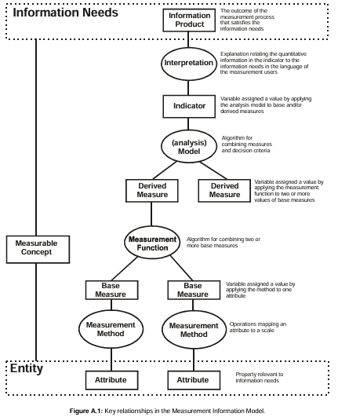

# Gestão do Projeto com PSM/CID

## Introdução

A gestão de processo é fundamental para garantir a qualidade e o sucesso dos projetos de software. Baseando-se na ISO/IEC 15939 e no princípio do PSM/CID, este documento apresenta a estruturação da gerência de processo, vinculados às práticas e diretrizes para o gerenciamento eficaz da medição de processos, promovendo a melhoria contínua e o alinhamento com os objetivos organizacionais (ou equipe). A motivação para adotar esse padrão internacional reside na necessidade de estabelecer métodos claros e confiáveis para coletar, analisar e utilizar dados, possibilitando decisões informadas e o aprimoramento dos resultados ao longo do ciclo de vida do software. Além disso, essa prática contribui para a coerência e coesão no própria gestão do projeto, além de mensurar o quão eficaz e adequada são as práticas e artefatos de um processo. Assim, essa página se concetra em estabelecer a gerência de processo vinculados ao projeto da disicplina de Qualidade de Software 1 (2025.1).

## Objetivos 

**Objetivo Geral**: Documentação e rastreabilidade da Gestão de processo e artefatos associados, visando a aplicação do Processo de medição de software proposto pela ISO/IEC 15939:2001.

**Objetivos Específicos**:
    
- Execução das etapas do Processo de medição que a gestão do processo.
- Implementação de três produtos de informação com integração ao Git/Github para monitoramento de processo.
- Avaliação dos resultados obtidos.

## Referencial teórico

O processo de medição, conforme definido na norma ISO/IEC 15939:2001, representa uma metodologia estruturada voltada ao apoio e melhoria contínua da **gestão de processos organizacionais** ([1](#ref-bib), p.7-8). Sua aplicação está centrada na coleta, análise e comunicação de dados que representam tanto os produtos desenvolvidos quanto os processos implementados pela unidade organizacional ([1](#ref-bib), p.7). Ao fazer isso, a medição se torna uma ferramenta gerencial que proporciona **tomada de decisão objetiva, monitoramento de desempenho e avaliação da qualidade**.

Segundo a norma, o processo de medição é constituído por quatro atividades principais que espelham o ciclo de melhoria contínua PDCA (Plan-Do-Check-Act ou, traduzido, Planejar-Fazer-Checar-Agir) e pode ser visualizado abaixo e em [Figura 1](#fig1) ([[1](#ref-bib)], p.7, 4.2):

- **5.1 Estabelecer e sustentar o compromisso de medição**  
  Visa garantir envolvimento da alta gestão e alocação de recursos para a execução sustentável da medição.
  
- **5.2 Planejar o processo de medição**  
  Engloba identificar necessidades de informação, selecionar medidas, definir procedimentos e critérios.

- **5.3 Executar o processo de medição**  
  Abrange coleta, armazenamento, análise de dados e geração dos produtos de informação.

- **5.4 Avaliar a medição**  
  Promove melhoria do processo com base em avaliações de eficácia e repositório de experiências.

#### **Figura 1**: Modelo de Processo de medição de software {#fig1}

**_Fonte_**: Retirado da ISO/IEC 15939:2001 ([1](#ref-bib), p. 9).

Essas atividades não são estanques, mas formam um ciclo iterativo de gestão, reforçando o vínculo entre **informação gerencial necessária** e os **produtos de informação** construídos com base em medidas adequadas.

### Principais Termos e Definições 

Alguns termos relevantes para o contexto segundo a ISO/IEC 15939:2001 ([[1](#ref-bib)], p.1-6):

- **atributo**: propriedade ou característica de uma entidade que pode ser distinguida quantitativamente ou qualitativamente por um humano ou automatizações.
- **entidade**: objeto que deve ser caracterizado através da medição dos seus atributos.
- **Medida Base**: medida definida em termos de um atributo e o método para quantificá-lo (independentes funcionalmente entre si).
- **Medida Derivada**: medida que é definida como uma função de dois ou mais valores
- **Medida**: variável à qual se atribui valor após operação de medição.
- **Indicador**: medida que fornece uma estimativa ou avaliação de atributos específicos derivados de um modelo acerca de necessidades informacionais (Information Needs) definidas.
- **Produto Informacional**: conjunto de indicadores e suas interpretações que satisfazem a(s) necessidade(s) informacional(is).
- **Necessidade Informacional**: conhecimento necessário para gerir objetivos, riscos e problemas.
- **Medição**: conjunto de operações que têm por objetivo determinar o valor de uma medida
- **Processo de medição**: conjunto de atividades para estabelecer, planejar, executar e avaliar a medição dentro de um contexto organizacional.
- **Modelo**: algoritmo ou cálculo que combina uma ou mais medidas de base e/ou derivadas com critérios de decisão associados.
- **Escala**: conjunto ordenado de valores, contínuos ou discretos, ou um conjunto de categorias às quais o atributo é atribuído.
- **Unidade de medida**: determinada quantidade, definida e adoptada por convenção, com a qual se comparam outras quantidades do mesmo tipo para exprimir a sua grandeza em relação a essa quantidade.
- **Valor**: resultado numérico ou categórico atribuído a uma medida de base, medida derivada ou indicador.

O processo é estruturado por meio do **Modelo de Informação de Medição**, que conecta diretamente os atributos observáveis dos elementos organizacionais às **necessidades informacionais** dos interessados (gerenciamento, técnica, qualidade). Isso permite uma abordagem sistemática na seleção de métricas e indicadores relevantes, com rastreabilidade desde a origem da necessidade até sua representação quantitativa e analítica.

Além disso, o processo é compatível com a abordagem CID/PSM, que organiza os artefatos da medição em níveis operacionais e estratégicos, desde o planejamento até a melhoria, reforçando o papel central da medição como parte da engenharia organizacional e da governança de qualidade.

## Metodologia

Este documento adota como fundamento metodológico o modelo de processo de medição estabelecido pela norma ISO/IEC 15939:2001, com o propósito de planejar, implementar e avaliar a medição de aspectos significativos relacionados ao desempenho da equipe durante o desenvolvimento de atividades no projeto. O principal objetivo é a produção de produtos informacionais e indicadores gerenciais que serão posteriormente disponibilizados por meio de dashboards, de forma a subsidiar a gestão estratégica dos processos organizacionais.

### Estrutura do Processo de Medição

Conforme descrito na norma, o processo de medição é composto por quatro atividades principais, organizadas em ciclos iterativos, baseados na abordagem de melhoria contínua (PDCA) [[1](#ref-bib)]:

1. **Estabelecer e sustentar o comprometimento com a medição**  
   Consiste na definição do escopo, formalização do comprometimento organizacional e alocação dos recursos necessários para a condução do processo de medição.

2. **Planejar o processo de medição**  
   Envolve a caracterização da unidade organizacional, identificação e priorização das necessidades de informação, seleção das medidas apropriadas (medidas base, derivadas e indicadores), bem como o estabelecimento dos procedimentos para coleta, armazenamento, análise, apresentação e avaliação dos dados.

3. **Executar o processo de medição**  
   Inclui a integração dos procedimentos definidos aos processos operacionais, coleta sistemática dos dados contextuais e verificados, análise quantitativa dos dados obtidos, e elaboração dos produtos informacionais.

4. **Avaliar a medição**  
   Refere-se à verificação da qualidade e relevância dos produtos de informação e à atualização da base de experiência da medição (*Measurement Experience Base*), identificando oportunidades de melhoria para ciclos subsequentes.

Aliado a isso, apresenta-se o Modelo Informacional de Medição, o qual mostra o conceito mensurável que parte desde a relação das necessidades informacionais até as entidades visto na [Figura 2](#fig2) abaixo.

#### **Figura 2**: Modelo Informacional de Medição (Measurement Informational Modelo) {#fig2}

**_Fonte_**: Retirado da ISO/IEC 15939:2001 [[1](#ref-bib), p. 20, Anexo A.1].

O modelo informacional de medição da ISO/IEC 15939:2001 estrutura-se como um sistema conceitual que conecta entidades observáveis — como processos, produtos ou projetos — a necessidades de informação gerencial por meio de atributos mensuráveis [[1](#ref-bib), p.21]. A partir desses atributos, definem-se medidas base (quantificações diretas), que podem ser combinadas em medidas derivadas por meio de funções de medição, e por fim modeladas em indicadores, os quais agregam valor analítico ao atender demandas específicas de decisão [[1](#ref-bib), p.21-22]. A complexidade e o grau de abstração da informação aumentam à medida que se avança das medidas base para os indicadores, aproximando-se das necessidades informacionais [[1](#ref-bib), p.23].

Esses indicadores são produzidos por modelos que agregam medidas e aplicam critérios de decisão — como limites, metas ou padrões — e são expressos em escalas que variam de nominal a razão, conforme a natureza dos atributos [[1](#ref-bib), p.21-22]. A aplicação prática do modelo exige que as medidas sejam concebidas com clareza metodológica, associadas a unidades convencionais de comparação e interpretadas à luz dos conceitos mensuráveis que expressam dimensões como desempenho, qualidade, risco ou produtividade. Assim, o modelo sustenta um processo iterativo de geração de conhecimento quantificável, confiável e acionável dentro da engenharia e gestão organizacional.

### Aplicação no Projeto

A metodologia será aplicada durante a execução das atividades da equipe, com foco em atributos como produtividade, qualidade técnica, eficiência de comunicação e entrega de valor. As necessidades de informação serão definidas em conjunto com os interessados e convertidas em medidas observáveis, conforme os modelos previstos na norma [[1](#ref-bib)].

Os dados serão extraídos dos fluxos operacionais do projeto (tais como sistemas de versionamento, gerenciamento de tarefas e produção de artefatos), e transformados em indicadores analíticos, como, por exemplo, tempo de ciclo, volume de entregas, taxa de retrabalho e grau de colaboração.

Esses indicadores serão apresentados em gráficos, podendo estar em painéis de visualização de dados (dashboards) ou outros mecanismos de integração com a plataforma Git/Github, permitindo acompanhamento contínuo da evolução do processo, análise de desempenho da equipe e suporte à tomada de decisão baseada em evidências quantitativas.

## Artefatos e Etapas do Processo

#### **Tabela 1: Artefatos do Processo de Medição**

| ID  | Artefato                | 
|-----|-------------------------|
| 1   | [Etapa 1: Estabelecimento e Comprometimento](../gerencia/estabelecimento.md)    |   
| 2   | [Etapa 2: Planejamento do Processo de medição](../gerencia/planejamento.md)    |   
| 3   | [Etapa 3: Implementação do Processo de medição](../gerencia/implementacao/preambulo.md)      |  
| 4   | [Etapa 4: Avaliação do Processo de medição](../gerencia/avaliacao.md) | 

**_Fonte_**: autores.

## Considerações e Conclusão

## Referencia Bibliográfica {#ref-bib}
> [1] [ISO/IEC. *ISO/IEC 15939:2001 – Software engineering — Software measurement process*. Geneva: International Organization for Standardization, 2001.](../assets/pdfs/iso-15939.pdf).

## Bibliografia
> [ISO/IEC. *ISO/IEC 15939:2001 – Software engineering — Software measurement process*. Geneva: International Organization for Standardization, 2001.](../assets/pdfs/iso-15939.pdf).
>
> [MCGARRY, Francis; CARD, David; JONES, Cheryl L.; et al. Practical Software Measurement: Objective Information for Decision Makers. Capítulo 2 – Measurement Information Model. Versão digital. [S.l.]: Software Engineering Institute (SEI), 2002.](../assets/pdfs/measurement-information-model.pdf)

## Tabela de Versionamento

<table>
  <thead>
    <tr>
      <th>Data</th>
      <th>Versão</th>
      <th>Descrição</th>
      <th>Autor</th>
      <th>Revisor</th>
    </tr>
  </thead>
  <tbody>
    <tr>
      <td>11/07/2025</td>
      <td>1.0</td>
      <td>Criação da Página principal de Gestão de Processo com as seções definidas e feito a Introdução e Objetivo.</td>
      <td><a href="https://github.com/MVConsorte">Mateus</a></td>
      <td><a href="https://github.com/RaissaAndradeS">Raissa</a></td>
    </tr>
    <tr>
      <td>11/07/2025</td>
      <td>1.1</td>
      <td>Adição do Referencial teórico.</td>
      <td><a href="https://github.com/MVConsorte">Mateus</a></td>
      <td></td>
    </tr>
    <tr>
      <td>12/07/2025</td>
      <td>1.2</td>
      <td>Adição da metodologia e tabela de artefatos com hiperlinks.</td>
      <td><a href="https://github.com/MVConsorte">Mateus</a></td>
      <td></td>
    </tr>
  </tbody>
</table>

